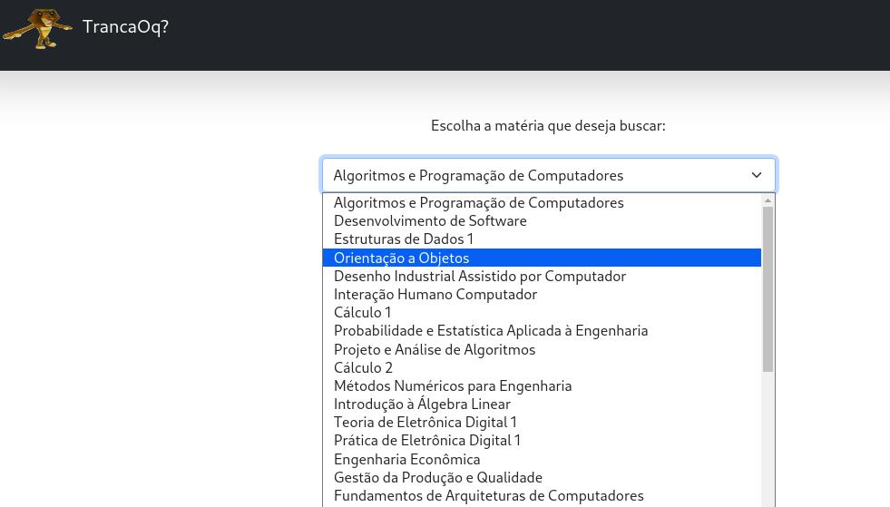
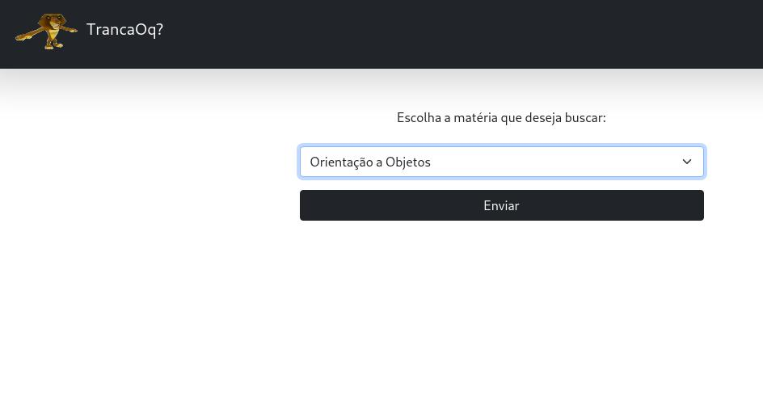
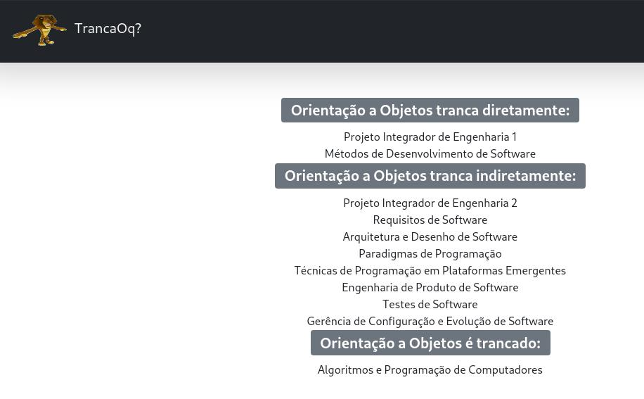

# Grafos1_TrancaOq?

**Número da Lista**: X<br>
**Conteúdo da Disciplina**: Grafos 1

## Alunos

|Matrícula | Aluno |
| -- | -- |
| 18/0106970  |  Matheus Gabriel Alves Rodrigues |
| 18/0129287 |  Pedro Henrique Vieira Lima |

## Sobre

Projeto de Grafos 1 onde se tem como objetivo a criação e melhoria nas consultas de 
matérias do curso de engenharia de software da FGA que atualmente é bem ruim no atual sistema SIGAA,
para isso o projeto consiste na criação de um grafo da grade do curso e utilizar algoritmos como DFS 
para buscar por informações de matérias.

## Screenshots





## Instalação

**Linguagem**: Python<br>
**Framework**: Flask<br>

``` bash
pip install flask pandas

python main.py

```


## Uso

Acesse a porta 5000 apartir do link [http://127.0.0.1:5000/](http://127.0.0.1:5000/) e escolha uma disciplina para pesquisar

## Outros

Também é possivel fazer requisições para uma API da disciplina apartir das seguintes rotas:

* [http://127.0.0.1:5000/dependents/<nome da disciplina>](http://127.0.0.1:5000/dependents/)

    Retorna uma lista de discplinas na qual a disciplina pesquisada tranca

* [http://127.0.0.1:5000/dependencies/<nome da disciplina>](http://127.0.0.1:5000/dependencies/)

    Retorna uma lista de discplinas na qual a disciplina pesquisada é dependente 
